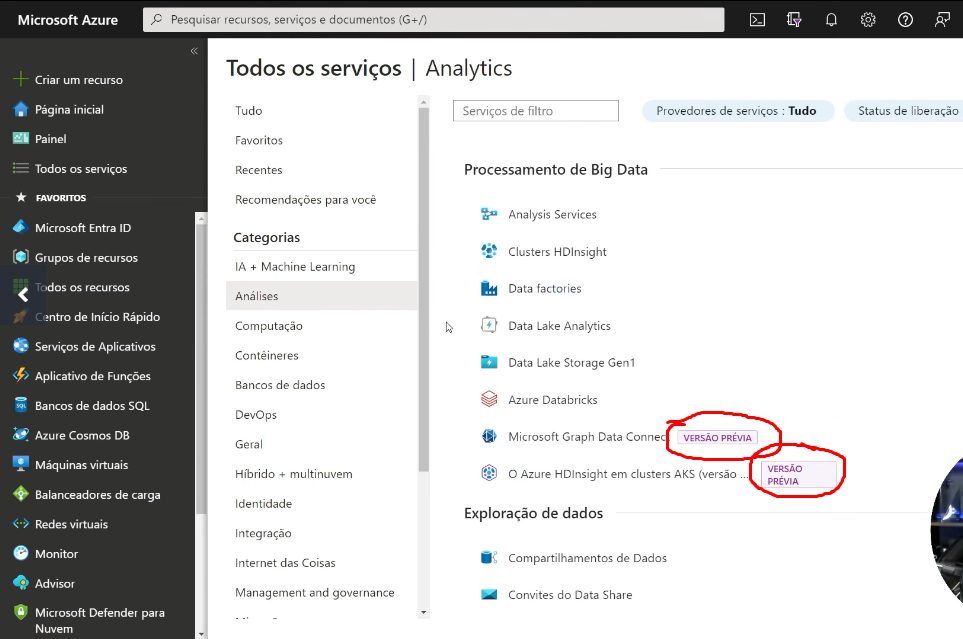

### microsoft--azure-resumo
## Overview dentro do Microsoft Azure

é como um grande menu de vários recursos diferentes; 

Mas nem todos os recursos ou regiões estão disponíveis a conta gratuíta uqe você pode criar [**aqui**](https://azure.microsoft.com/pt-br/pricing/purchase-options/azure-account/search?icid=free-search&ef_id=_k_CjwKCAiA3Na5BhAZEiwAzrfagNX6XXXmjpr_sU91KycQ9z-epzz3xByvzeYPdVx9aqUEJ9kAwx0eWBoC27AQAvD_BwE_k_&OCID=AIDcmmzmnb0182_SEM__k_CjwKCAiA3Na5BhAZEiwAzrfagNX6XXXmjpr_sU91KycQ9z-epzz3xByvzeYPdVx9aqUEJ9kAwx0eWBoC27AQAvD_BwE_k_&gad_source=1&gclid=CjwKCAiA3Na5BhAZEiwAzrfagNX6XXXmjpr_sU91KycQ9z-epzz3xByvzeYPdVx9aqUEJ9kAwx0eWBoC27AQAvD_BwE)

#### Personalização/Modificações da plataforma
Temos a possibilidade de mudarmos a cor e o Idioma dentro do Microsoft Azure

### Categorias de Serviços/Recursos

Na aba lateral em "Todos os Recursos" podemos ver as categorias de cada 

Em cada um se tem uma coleção de recursos de diferentes funções relacionados aquela categoria, como "banco de dados", "rede" e etc. Cada um super importante para um bom "match" na peerformance da máquina cloud

### Produtos em versão prévia
Existe a possibilidade de inscontância da continuação do serviço, que pode sumir! Ideal apenas para testar e não criar algo sério;

